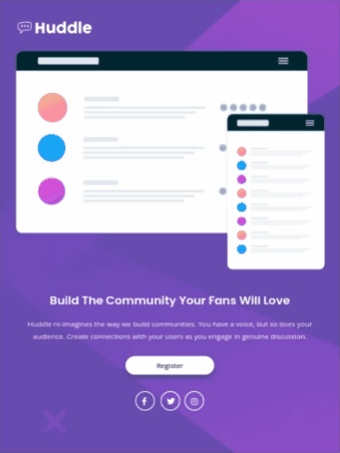
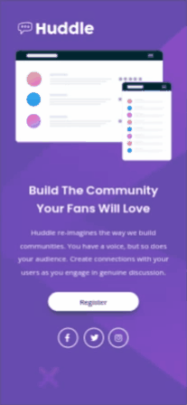

# landing page huddle

#### Landing page huddle é um desafio do Frontend Mentor feito com HTML e CSS. Esse projeto, apresar de ser uma landing page, traz elementos de nível avançado nessas linguagens. Obrigado por cgegar até aqui e confira o código.

## Índice

- [Captura de tela](#captura-de-tela)
- [Links](#links)
- [Construído com](#construído-com)
- [O que aprendi](#o-que-aprendi)
- [Desenvolvimento contínuo](#desenvolvimento-contínuo)
- [Recursos úteis](#recursos-úteis)
- [Fernando Mendes](#autor)

### Captura de tela

#### Tela Desktop


#### Tela Ipad



#### Tela Mobile



### Links

- Site URL: https://nandosti.github.io/landing-page-huddle/

### Construído com

<div style="display: inline_block"><br>
  
         
</div>

### O que aprendi

Nesse projeto envolvendo HTML e CSS, aprendi conceitos importantes. Através do CSS, aprendi a dar estilo e formatar elementos HTML, explorando propriedades como cores, fontes, posicionamento,animações, responsividade, pseudo classes e pseudo elemento. No processo de aprendizado, foi importante entender os conceitos fundamentais de cada linguagem. Praticar esses conceitos em projetos reais nos ajuda a aprimorar nossas habilidades e explorar diferentes técnicas e soluções para os desafios que encontramos.

## Trechos de códigos

```
@media(max-width: 425px){

    .container .wrapper .main img{
        width: 100%;
    }
    .container .wrapper .main{
        flex-direction: column;
        text-align: center;
    }

    .container .wrapper .main .hero-text h1{
        font-size: 26px;
    }## Agradecimentos

Gostaria de agradecer a toda comunidade do DEVQUEST: monitores, alunos e toda a equipe técnica que sempre está de prontidão para ajudar no que for preciso. Deixo aqui um abraço a todos que fazem parte desse projeto. Agradecer ao meu grupo de crescimento GC Kennedy que tem contribuido muito para o meu crescimento pessoal.

    .container .wrapper .social{
        text-align: center;
        margin-top: 50px;
    }

    .container .wrapper .main .hero-text a{
        padding: 10px 70px;
    }

}

```

### Desenvolvimento contínuo

Pretendo continuar focado em construir um conhecimento sólido nessas limguagens. Ainda há muitos conceitos importantes para serem desenvolvidos. Todos os dias são gradativamente adicionados ao meu repertório de ferramentas.

### Recursos úteis

- [W3School](https://www.w3schools.com/css/default.asp) - Esse site sempre me ajuda a resolver qualquer problema relacionados a códigos de uma maneira fácil e muito rápida.
- [Dev em Dobro](https://www.youtube.com/@DevemDobro) - Este é um canal onde encontro muito material. Tem muito conteúdo relacionado ao desenvolvimento. Recomendo a todos que querem aprender sobre esse e outros conceitos relacionados.

## Autor

[Fernando Mendes](https://www.linkedin.com/in/fernandomendesti/)
